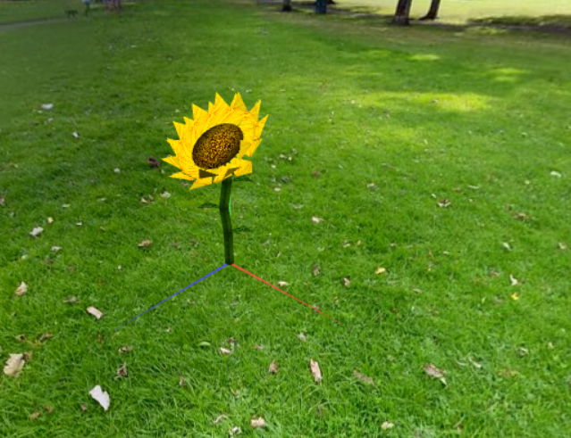
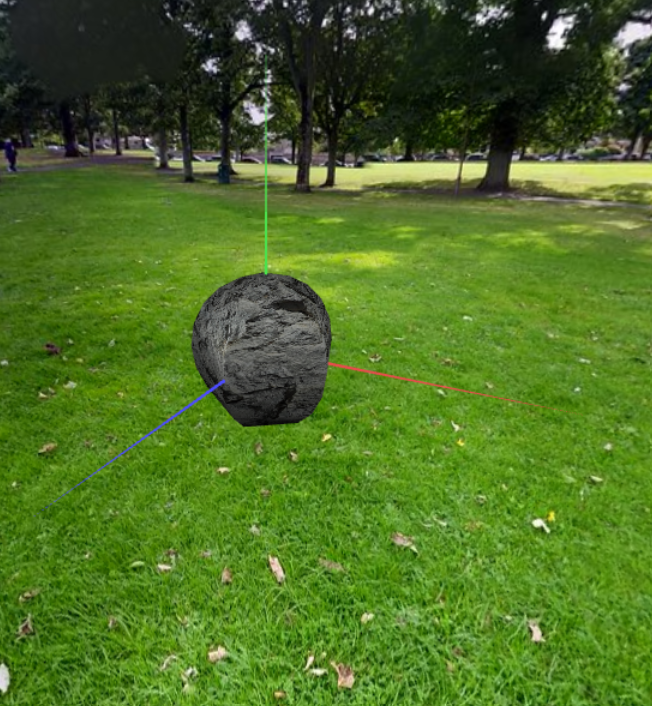

# CG 2023/2024

## Group T11G09

## 1. Sky-Sphere

### 1.1. Criação de uma Esfera

No primeiro exercício, criamos uma nova classe `MySphere.js` que cria uma esfera com o centro na origem, com eixo central coincidente com o eixo Y e raio unitário. 

A esfera tem um número variável de slices e de stacks, este último correspondendo ao número de divisões angulares, desde a linha de equador até aos pólos.

Na função `initBuffers()`, começamos por criar todos os vértices (assim como as respetivas normal e coordenadas de textura), seguida da criação dos índices, tendo em consideração o pormenor de que ao redor dos pólos, a stack é formada por triângulos em vez de quadriláteros. 

Figura 1: Sphere with Earth texture

### 1.2. Adição de Panoramas

Utilizando a classe `MySphere`, conseguimos facilmente criar um panorama, invertendo as suas faces, de forma a que seja visível por dentro e não por fora.

Desta forma, na classe `MyPanorama`, o construtor recebe uma CGFtexture, e é responsável por criar uma MySphere invertida, dotada de um material apenas com componente emissiva e coberta pela textura passada como argumento.

Por fim, para criar a ilusão de que a superfície esférica se encontra sempre posicionada no infinito, aplicamos um movimento de translação ao panorama de modo a que ficasse sempre centrada com a câmara.

Figura 2: Earth and Panorama

## 2. Flores

No exercício dois, desenvolvemos um modelo simplificado de uma flor, utilizando apenas polígonos básicos. Para otimizar o desempenho computacional, decidimos representar o receptáculo da flor como um círculo em vez de uma esfera.

Além disso, os cilindros que compõem o caule da flor têm comprimentos variados, controlados aleatoriamente, resultando num desalinhamento entre eles.

Figura 3: Flower

Por fim, criamos uma zona  `MyGarden` no mundo virtual, que consiste numa matriz de flores com um número específico de linhas e colunas definido na interface UI/UX.

Cada flor na matriz é gerada com valores aleatórios nos seus parâmetros, tais como o número de pétalas, os ângulos de curvatura das pétalas, o raio do círculo central da flor, o raio do círculo representando o caule, assim como os comprimentos e ângulos entre os cilindros que formam o caule.

Figura 4: Garden

## 3. Pedras e penedos

No exercício três, desenvolvemos um modelo simplificado de uma rocha, adaptando o modelo usado `MySphere`,  pela qual mantivemos inalteradas as coordenadas dos vértices, fazendo alterar ligeiramente a inclinação das respectivas normais (seguindo a sugestão dada no enunciado).

Figura 5: Rock

Para construir o penedo, apenas criamos várias pedras com coordenadas próximas entre si, de forma a sobrepostas.

Figura 6: Rock Set

## 4. Abelha

### 4.1. Modelação da abelha

Nesta etapa do projeto, modelamos uma abelha, utilizando uma combinações dos diferentes objetos utilizados nos trabalhos anteriores. Assim sendo, a abelha é constituída por cabeça com olhos, tórax e abdómen, dois pares de asas, um par de antenas e três pares de patas.

Figura 7: Bee

### 4.2 Animação da abelha

No segundo passo do ponto 4, é controlado pelo `elapsed time` do programa. As asas, como previsto, têm uma velocidade dez vezes superior ao restante corpo da abelha.

### 4.3 Controlo da abelha

No último passo do ponto 4, implementamos o controlo da abelha utilizando o código base já fornecido e uma classe nova `MyMovement.js`, que calcula e atualiza a velocidadeda abelha em qualquer momento da trajetória.

Figura 8: Bee Animation

## 5. Pólen e colmeia

### 5.1. Pólen

De forma a que a abelha apanhe os grãos de pólen, foi adicionada uma instância da classe `MyPollen.js` a cada uma das flores do jardim. 

Figura 9: Flower with pollen

### 5.2. Colmeia

De seguida, criamos uma nova class `MyHive.js`, que representará a colmeia da abelha, colocada sobre o monte de pedras/penedos descrito anteriormente.

Figura 10: Hive

## 5.3. Movimentação

- Ao pressionar a tecla **F** a abelha desce até tocar a flor, onde fica parada

- Pressionando **P**, a abelha volta a subir à altura inicial, agora transportando o grão de pólen

- Se a abelha estiver em vôo, a transportar um grão de pólen e se for pressionada a tecla “O”, ela dirige-se à entrada da colmeia onde o larga

Figura 11: Catching pollen

