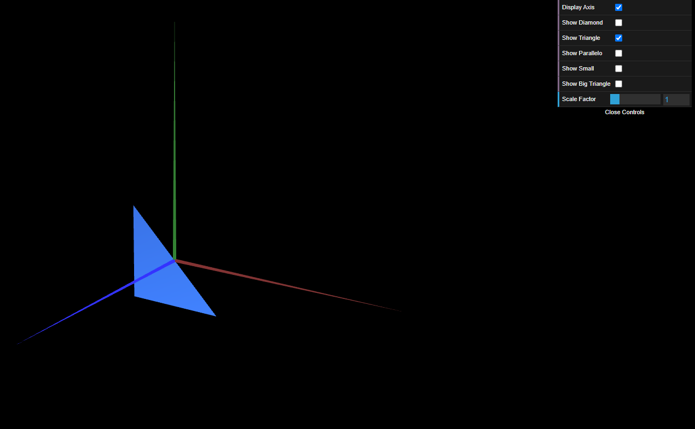
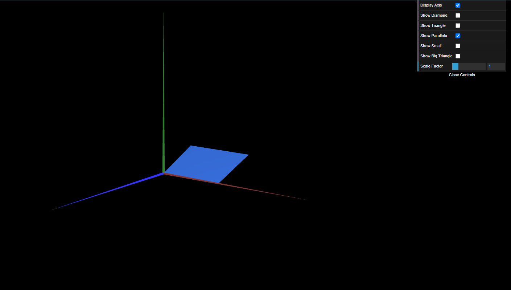
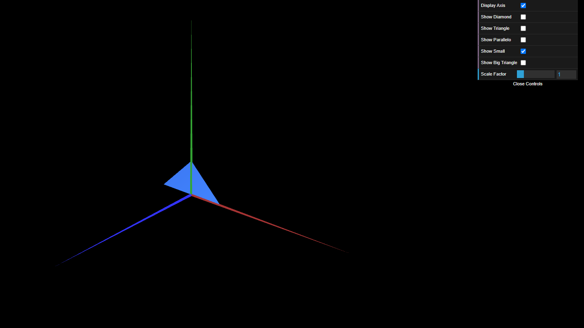
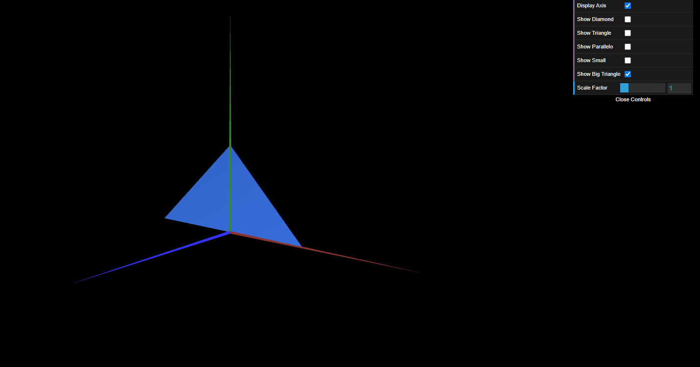

# CG 2023/2024

## Group T09G11

## TP 1 Notes

- No exercício 1, criamos os ficheiros **Triangle.js** e **Parallelogram.js** de forma a representarmos um triângulo e um paralelogramo. Também adicionamos as respetivas checkboxes ao ficheiro **MyScene.js**.
- No exercício 2, criamos os triângulos pequeno - **TriangleSmall.js** - e grande - **TriangleBig.js** - a partir do ficheiro criado no exercício anterior - **Triangle.js**.

Figure 1: Losango

Figure 2: MyTriangle

Figure 3: MyParallelogram

Figure 4: MyTriangleSmall

Figure 5: MyTriangleBig

