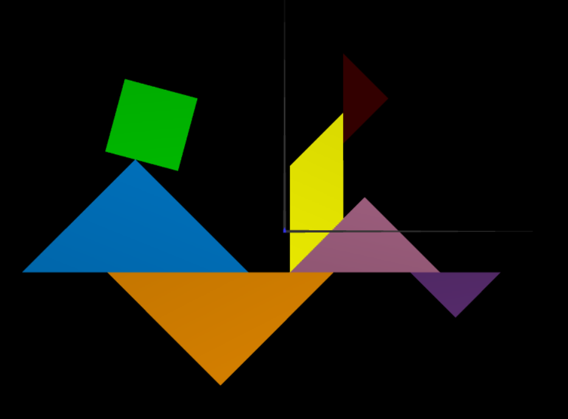
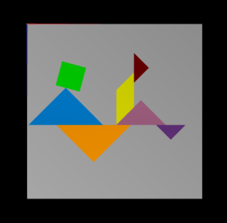
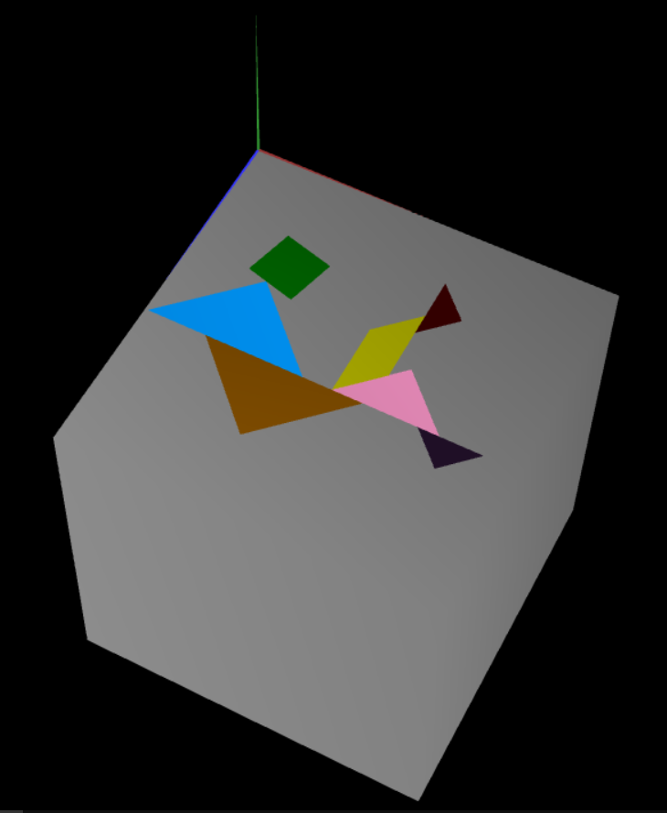
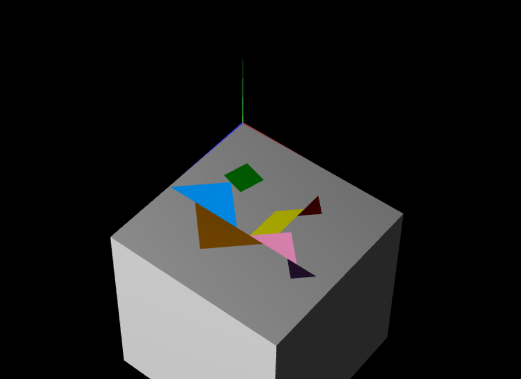

# CG 2023/2024

## Group T09G11

## TP 2 Notes

- No exercício 1, recriamos a figura Tangram fornecida em aula, criando uma classe `MyTangram.js`, constituída pelos objetos `MyDiamond`, `MyTriangle` e `MyParallelogram`, sobre os quais aplicamos transformações geométricas, nomeadamente translações, rotações e scalamentos. Enquanto que as transformações geométricas do `MyDiamond` foram obtidas através de operações de multiplicação de matrizes (recorrendo à função `multMatrix()`), obtamos por utilizar as funções do WebCGF para as restantes peças (`CGF.scene.translate()`, `CGF.scene.rotate()`, `CGF.scene.scale()`,). 

Figure 1: MyTangram

- No exercício 2, criamos cubo unitário, centrado na origem e de aresta unitária, construído com uma única malha de triângulos. Para tal, foi necessário definir na função `initBuffers` os 8 vértices do cubo, assim como a conectividade entre eles de forma a formar os triângulos que constituem as faces quadradas do cubo. Posteriormente, combinámo-lo com a figura obtida no exercício anterior, aplicando uma rotação neste conjunto composto, de modo a que a figura de Tangram ficasse colocado paralelo ao plano XZ, com o vértice superior esquerdo na origem.

Figure 2/3: MyUnitCube + MyTangram

- No exercício 3, criamos novamente um cubo unitária, desta vez composto por planos, isto é, foi possível obter o mesmo cubo através de transformações geométricas para desenhar o objeto de `MyQuad` (que representa um quadrado unitário) como as seis faces do cubo unitário. 

Figure 4: MyUnitCubeQuad + MyTangram

