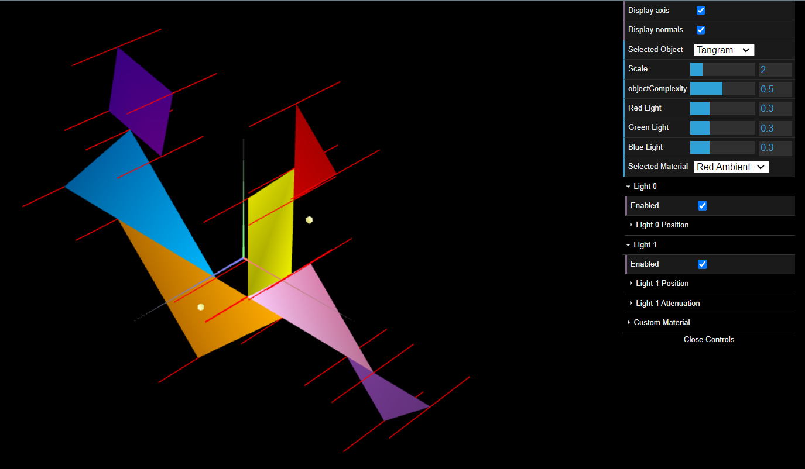

# CG 2023/2024

## Group T09G11

## TP 3 Notes

- No exercício 1, a partir das figuras criadas nas aulas anteriores criamos as normais correspondentes. Criamos um material de cor semelhante a madeira com baixa componente especular.

Figure 1: Wood cube

Ainda no exercício 1 aplicamos materiais com alta componente especular às figuras presentes no tangram.

Figure 2: Tangram

- No exercício 2 construimos um prisma com um número variável de lados. Implementamos um algoritmo de forma a criar vértices, descrever triângulos e criar as normais em cada vértice.

Figure 3: Prism

- No exercício 3 as normais foram postas perpendicularmente a cada aresta. Esta figura ficou com um aspeto mais curvo em relação ao prisma anteriormente feito.

Figure 4: Cylinder
