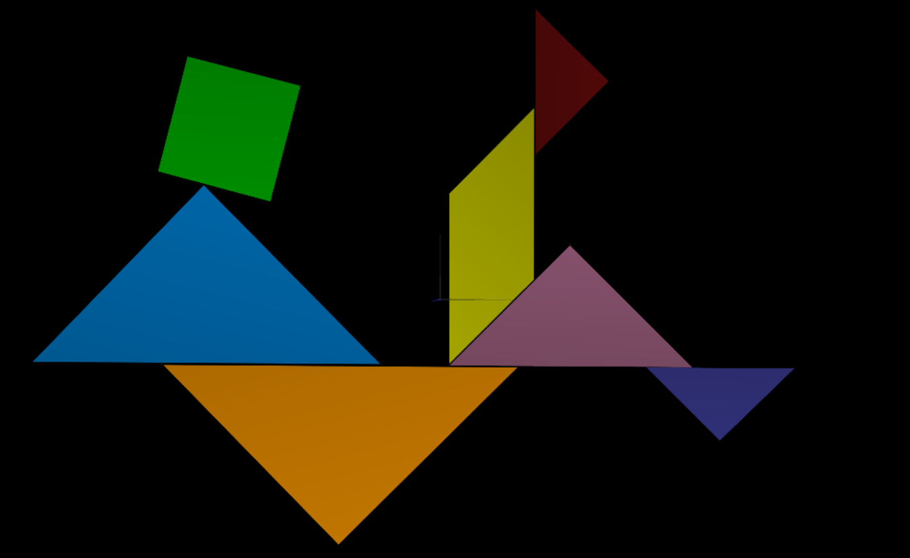
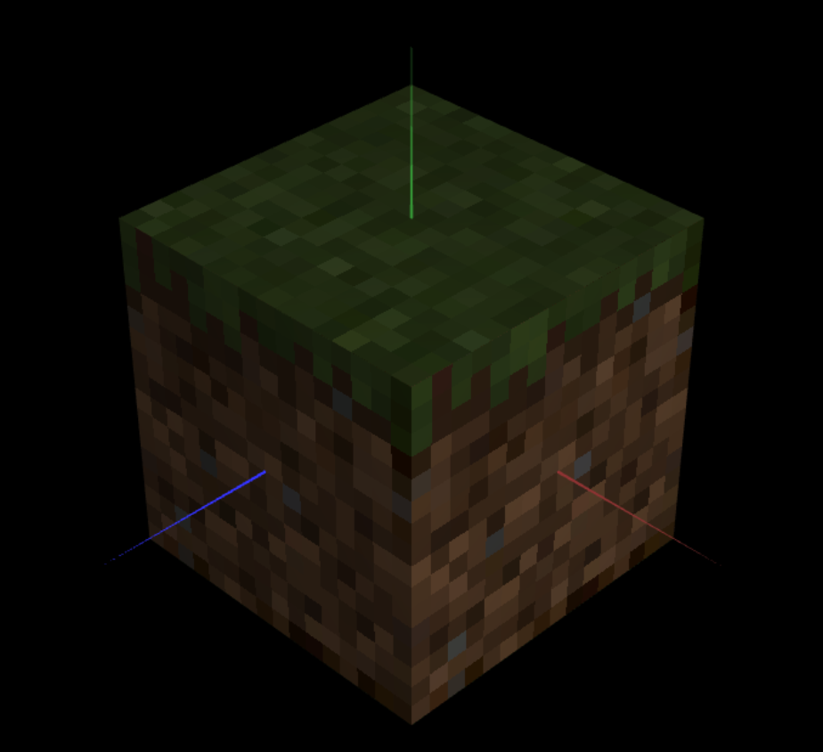

# CG 2023/2024

## Group T11G09

## TP 4 Notes

- No primeiro exercício, realizamos o mapeamento da textura "tangram.png" em cada vértice de todos os polígonos presentes na figura. Utilizamos a textura auxiliar "tangram-lines.png" para auxiliar na criação das partições necessárias.

Figure 2: Textura tangram.png

- No segundo exercício, aplicamos textura em todos os quadrados utilizados na classe MyUnitCubeQuad, implementada na TP2. Devido à diferença de escala entre a imagem da textura e a área a ser coberta em cada quadrado, ocorreu inicialmente uma desfocagem na figura devido à interpolação linear de cores por padrão. No entanto, ao modificar o tipo de filtragem, a imagem tornou-se nítida:

Figure 3: Cubo de Minecraft
