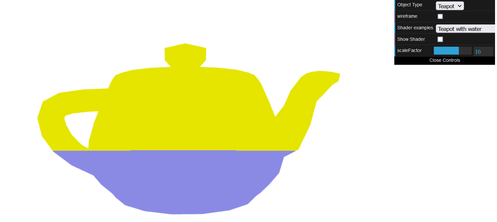

# CG 2023/2024

## Group T11G09

## TP 5 Notes

- No primeiro exercício, criamos os shaders `bule.vert` e `bule.frag` para colorir o bule em função da posição ocupada na janela pelos fragmentos - amarelo na metade superior, azul na metade inferior. Para tal, usamos a posição dos vértices após a transformação (tal como armazenada em gl_Position), passando a mesma para o fragment shader através de uma variável varying.
  

Figure 1: Bule com água

- De seguida, criamos um efeito de translação para trás e para a frente no eixo XX, seguindo uma onda sinusoidal, que está dependente do scaleFactor da interface.
  
- Por fim, criamos um novo fragment shader `gray.frag`, onde convertemos a cor para tons de cinza.

Figure 2: Bule com tons de cinza

---

- No segundo exercício, criamos shaders para aplicar uma textura de água no plano. As coordenadas da textura são alteradas ao longo do tempo para criar uma animação, enquanto os vértices do plano são manipuladas com base nas informações de cor da textura (a componente vermelha). 

Figure 3: Efeito de água
